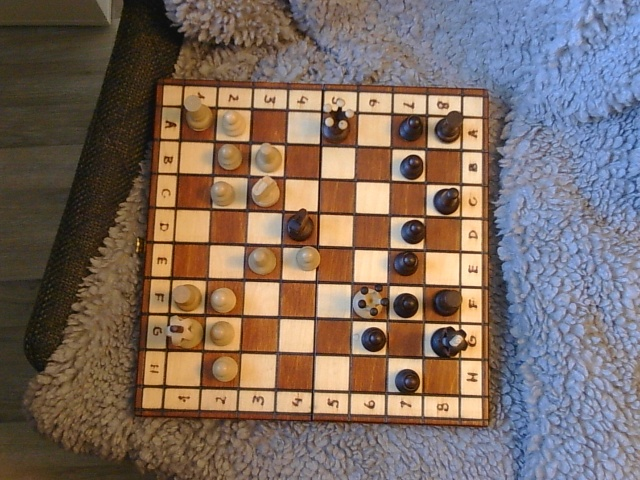
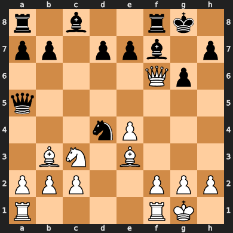
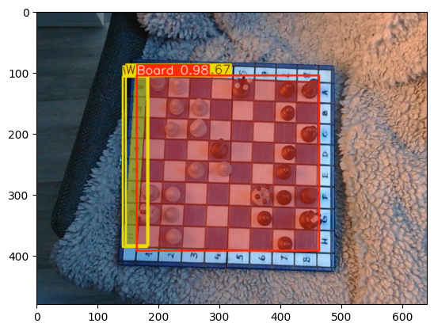
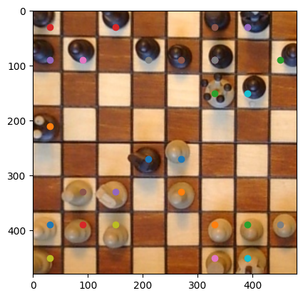

# Chess

# Chessboard to FEN

An end-to-end computer vision pipeline that converts a photograph of a physical chessboard into a [FEN](https://en.wikipedia.org/wiki/Forsyth%E2%80%93Edwards_Notation) string, combining two YOLO models with classical CV (Harris corners, homography).

  
  &nbsp;
  

## Pipeline

**1. Segmentation** — A YOLO segmentation model produces two masks: the board, and a marker on White's side. The board was deliberately chosen to be visually **non-symmetric** so the model has a learnable signal for orientation — something impossible on a standard symmetric board.

**2. Corners & homography** — Harris corner detection (restricted to the board mask) finds the four corners, which are used to compute a homography warping the board into a bird's-eye view.

**3. Rotation** — The white-side mask is used to rotate the BEV so White is always at the bottom.

**4. Piece detection & FEN** — A second YOLO model detects and classifies all pieces. The BEV is split into an 8×8 grid; each piece is assigned to its nearest square and the board state is serialized to FEN.

## Dataset

175 hand-labeled images on a single, visually asymmetric board, with varied lighting, angles, and piece configurations. Heavy data augmentation was used to account for ligthing and angle differences.

## Tech Stack

Python · [Ultralytics YOLO](https://github.com/ultralytics/ultralytics) · OpenCV · NumPy

## Potential future improvements

- Currently uses the middle of the bounding box, but it could be possible to calculate the bottom of each piece, generalizing to other angles.

- Improve the piece detection model by expanding the dataset and using a weighted loss function.

- Including an open-source model to suggest moves based on the FEN. This would allow for playing/practicing against a computer over the board.

